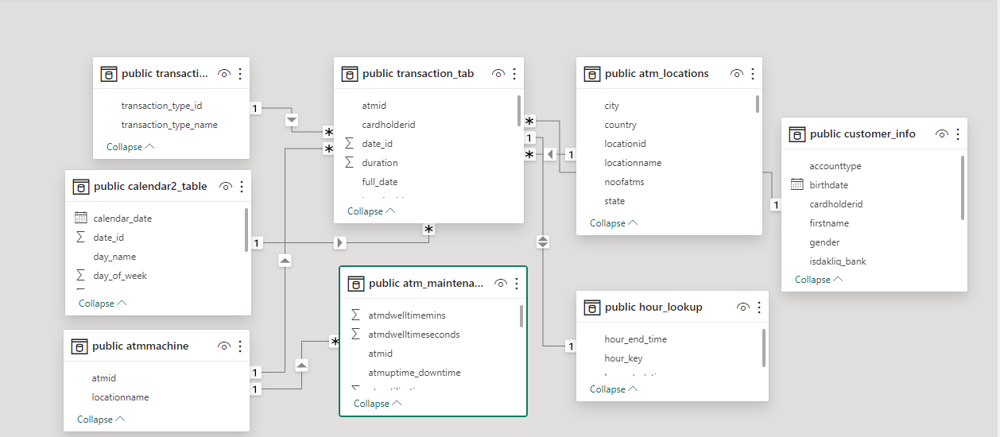
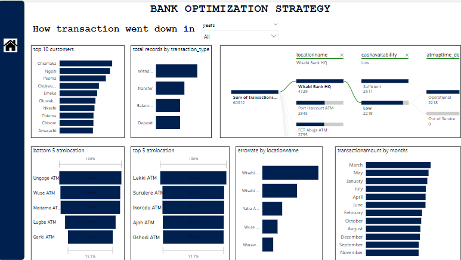
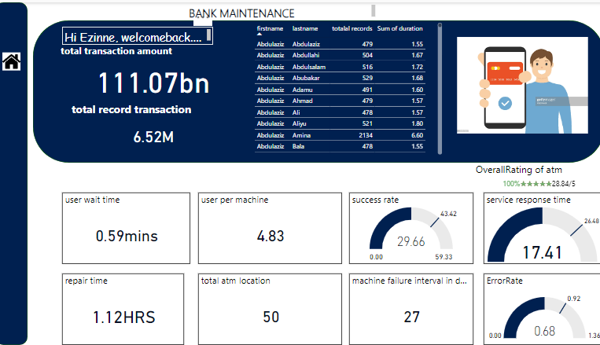

# ATM-optimization-strategy
Objective: Analyze a bank dataset to extract insights and inform strategic decision-making.

## Introduction
In the 21st century, the evolution of financial practices has spurred the establishment of numerous banks, as individuals increasingly find security in entrusting their money to these institutions. Banks, functioning as secure repositories, allow us to manage our finances through transactions such as transfers and debits.
This SQL project revolves around a sophisticated bank database consisting of 12 tables, complemented by a comprehensive data dictionary. The primary focus of this initiative is to systematically monitor and evaluate the operational efficiency of Automated Teller Machines (ATMs) spanning various states and locations. The expansive dataset aims to offer insights into the performance metrics of each ATM location, revealing trends and patterns observed over the past year.
The 12 tables integrated into the database structure act as repositories for diverse information related to ATM transactions, encompassing transaction logs, geographical details, and performance indicators. The data dictionary, an essential element of the project, serves as a crucial reference, elucidating the structure and relationships among the tables. This, in turn, facilitates a nuanced understanding of the intricate database schema.

## PROJECT OBJECTIVES:
The optimization of maintenance for Automated Teller Machines (ATMs) stands as a critical initiative, directed towards elevating operational efficiency and ensuring the flawless functionality of these systems. This strategic endeavor is underpinned by a set of key objectives, working in concert to bolster the overarching effectiveness of ATM maintenance processes.
1.	Analysis of ATM Usage Patterns: Delving into the patterns of ATM usage provides valuable insights into customer behavior. Identifying peak hours and pinpointing locations with the highest ATM usage enables us to scrutinize underperforming ATMs in various areas, facilitating an understanding of factors contributing to deviations from established standards.
2.	Evaluation of ATM Downtime: Systematically assessing the downtime of specific ATM locations involves identifying the reasons for malfunctions and investigating the correlation between ATM downtime and customer retention. This analysis aims to uncover the intricacies surrounding the operational disruptions and their potential impact on customer satisfaction and loyalty.
3.	Tracking Transaction Success Rates: Vigilantly monitoring the success rates of transactions for both customers and ATMs proves instrumental in maintenance efforts. This entails identifying unsuccessful transaction rates at different ATM locations, discerning patterns of transaction failures, and evaluating whether certain locations experience higher rates of transaction mishaps. Additionally, assessing the impact of transaction failures on customer retention becomes a crucial aspect of this comprehensive analysis.
4.	Analysis of Customer Behavior and Wait Time: Acquiring customer information related to ATM usage assumes a pivotal role, considering that customers are the lifeblood of any bank. This analysis seeks to unveil the most prevalent transaction types, assess the duration customers spend in line before service, and explore the potential impact of wait times on customer retention. Additionally, the investigation delves into whether specific transaction types influence customer loyalty and examines variations in customer retention across diverse ATM locations.

5.	Detection of Transaction Fraud: Recognizing the omnipresent threat of fraud, the analysis of transaction fraud detection becomes imperative. This process involves fortifying security measures at locations with a higher incidence of fraud. By scrutinizing fraud patterns, it becomes possible to identify which ATM locations are more susceptible to fraudulent activities and assess whether customer wait times contribute to an increased likelihood of fraudulent practices.

## TOOLS USED
PostgreSQL- for data transformation

Power bi- for  data analyzation and data visualization

## DATA TRANSFORMATION (PostgreSQL)

Initially, I established a foundational table before integrating the remaining 12 tables, excluding the data dictionary. These tables encompassed crucial data such as ATM location, ATM maintenance schedule, calendar lookup, customer lookup, and specific state tables (Enugu, FCT, Kano, Lagos, and River).

I appended the state tables (Enugu, FCT, Kano, Lagos, and River), removed duplicate entries, and standardized the handling of missing values. Numeric values with N/A were transformed into 0, while alphabetical values were filled down their respective columns to address N/A entries comprehensively. 

Subsequently, I generated a new calendar table, commencing from the year 2019, as the previous one did not align with the transaction dates.

## DATA TRANSAFORMATION (data modelling in powerbi)

After completing work with PostgreSQL, I imported my dataset into Power BI and proceeded to construct a data model. During the model creation process, I addressed a many-to-many relationship by introducing a bridge table to establish the necessary connections. A data model serves as a valuable tool for understanding the relationships within your dataset and contributes to providing meaningful insights. In my particular case, the resulting model took the form of a snowflake model, exemplifying the intricacies of the dataset's interconnections.

## ANALYSIS:
1. The bank held a total amount of 11.1 billion.
2. The bank experienced 2,282,477 transactions for withdrawals, 1,572,240 for transfers,  1,334,850 for balance inquiries, and 1,334,225 for deposits. This indicates that their ATMs were consistently operational and well-utilized.
3. On average, the ATM machines failed every 27 days, and the repair time for each failure was approximately 1.12 hours.
4. The male category constituted 50.27% of the records, slightly surpassing the female category, which accounted for 49.79%.
5. In terms of transaction records, LAGOS stands out with a leading total of 2,586,216 transactions, trailed by Rivers State with 1,249,749, Kano with 1,080,749, Enugu with 1,069,126, and finally, FCTS with 937,952.

 6.When considering account types, the data reveals that savings accounts generated a higher revenue share at 56.55%, whereas current accounts contributed 43.45% to the total income.

 7.Furthermore, the analysis indicates that the machines in use tend to malfunction after an average period of 27 days.
8. The chart indicates that the transaction amounts for March and May are closely aligned, with a slight variance of 3.4 million. These two months stand out as having the highest transaction volumes, followed by January and July. Conversely, April, June, February, October, August, December, September, and November represent the months with comparatively lower profitability for the bank. September is the least lucrative, with a transaction amount of 8.5 million, while November follows closely behind with 8.4 million.

## RECOMMENDATION:
Optimize ATM Maintenance: Given the average ATM failure rate of every 27 days, it is recommended to enhance maintenance protocols to prevent disruptions in service. This could involve proactive monitoring, predictive maintenance strategies, and efficient repair processes to minimize downtime.

Explore Savings Account Opportunities: Since savings accounts contribute a significant share of 56.55% to the bank's income, there could be opportunities to further encourage savings and explore strategies to attract more customers to open savings accounts.

Gender-Based Marketing Strategies: With a nearly equal distribution between male (50.27%) and female (49.79%) customers, consider tailoring marketing strategies to cater to the specific preferences and needs of each gender, potentially enhancing customer engagement and satisfaction.

Regional Focus for Growth: Given the transaction data, there is a substantial volume in Lagos. Consider implementing targeted initiatives to capitalize on this market, potentially expanding branch presence or introducing services that specifically cater to the preferences of customers in Lagos.

Efficiency in Repair Time: While the average repair time is relatively short at approximately 1.12 hours, continually optimizing the repair process can further enhance operational efficiency and minimize any inconvenience to customers during maintenance periods.

Strategic Partnerships: Explore potential collaborations with businesses or institutions in regions with lower transaction volumes, such as FCTS, to increase market penetration and drive more transactions.

Customer Education on ATM Services: As the bank experienced substantial transaction volumes for withdrawals, transfers, balance inquiries, and deposits, there could be opportunities to educate customers on the full range of services available at ATMs, potentially encouraging more diverse use and reducing workload on traditional banking channels.
The analysis of transaction amounts by month suggests focusing on leveraging the high transaction periods in March and May. Implement targeted marketing and promotions during these months to encourage increased customer activity. For the lower transaction months like September and November, consider introducing special offers to stimulate financial engagement. Conduct a thorough investigation into the factors influencing success in peak months and challenges in less profitable periods. Use these insights to refine marketing strategies, improve customer retention, and optimize overall financial performance throughout the year. Regular monitoring and adjustments based on ongoing data analysis will contribute to sustained success.

## CONCLUSION:
n conclusion, this comprehensive analysis of the bank's Automated Teller Machine (ATM) operations revealed key insights into usage patterns, downtime evaluation, transaction success rates, customer behavior, and fraud detection. The project utilized PostgreSQL for data transformation and Power BI for data modeling and analysis. The resulting snowflake data model highlighted intricate interconnections within the dataset.

The bank's ATMs proved well-utilized, with over 2 million transactions for withdrawals, transfers, balance inquiries, and deposits. The average ATM failure rate was approximately every 27 days, with a quick repair time of 1.12 hours. The gender distribution was nearly equal, and transaction records showed regional variations, with Lagos leading in transaction volume.

Recommendations focused on optimizing ATM maintenance, exploring savings account opportunities, tailoring gender-based marketing strategies, regional growth initiatives, efficient repair processes, strategic partnerships, and customer education on ATM services. The conclusion emphasized the need for proactive maintenance, targeted marketing, and continuous analysis to enhance operational efficiency, customer engagement, and overall financial performance.

## Summary:
The analysis of the bank's ATM operations using PostgreSQL and Power BI revealed high transaction volumes, a 27-day average ATM failure rate, and quick repairs. The data showed a balanced gender distribution and regional variations in transactions, with Lagos leading.

Key recommendations include optimizing maintenance, exploring savings account opportunities, tailoring gender-based marketing, focusing on regional growth, streamlining repair processes, forming strategic partnerships, and educating customers. The conclusion emphasizes the importance of proactive measures, targeted strategies, and ongoing analysis for enhanced operational efficiency and financial performance.

For more interactive dashboard click <iframe title="Report Section" width="600" height="373.5" src="https://app.powerbi.com/view?r=eyJrIjoiNjY3ZGU5NTItMTA2Yy00ZTU3LWFjYWItNWU1MTk2ZWIyZjdhIiwidCI6ImRkNDg0OTZkLWE3ZDEtNDhmOS05ZGRiLTA4MTJiY2Q1ZTlkNCIsImMiOjZ9" frameborder="0" allowFullScreen="true"></iframe>

calculation script click https://1drv.ms/w/c/2df36fc48e88ac97/EdN5EUtgtFJLqfkBbOoO47UBBLEKu_gdm6u5WcZkziMreQ?e=nb7cVD

